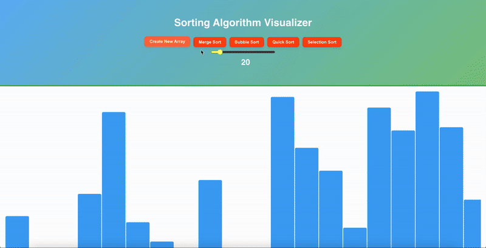

# 🌀 Sorting Algorithm Visualizer 🚦

A React web app that **visualizes popular sorting algorithms** with animated bars.  
This project helps you understand how sorting algorithms like Merge Sort, Quick Sort, Bubble Sort, and more work, through interactive animations. 🎥✨

---

## 🎬 Demo

---

## 🚀 Features

- Visualizes sorting algorithms with smooth animations:
  - 🔀 Merge Sort
  - ⚡ Quick Sort
  - 🧼 Bubble Sort
  - 🔍 Selection Sort
  - 📦 Heap Sort (in progress)
- 🎚️ Adjustable array size with a slider
- 🔄 Generate a new random array anytime
- 🌈 Color-coded bars indicate comparisons and swaps
- 📱 Responsive layout for desktop and mobile

---
